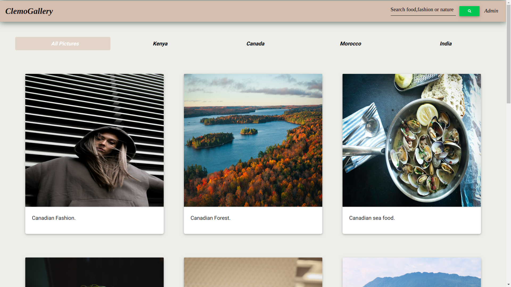
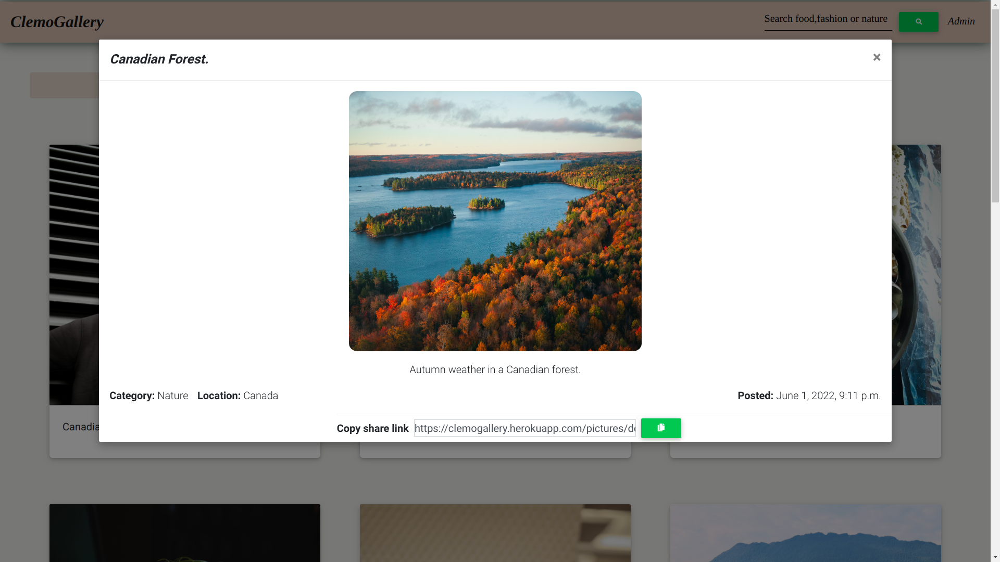
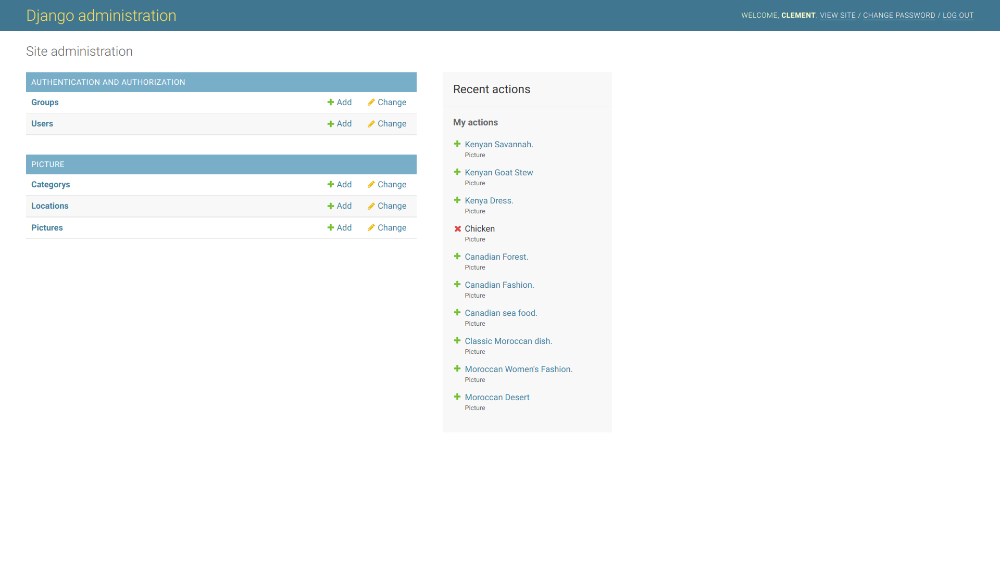

# ClemoGallery

## Author
 [Clement Lumumba](https://github.com/Clemo97/django-week-1.git)

# Description
This is a photo gallery application, where users can find images based on location and type categoris.

## Screenshot
1. Landing page

    

2. Image modal

    

3. Search by category(nature) 

    
    
4. Admin view

    

## Live Link
[Name of website](website link)
## User Story

1. View different photos that interest them
2. Click a single image to expand it and view the details of that photo
3. Search for different categories
4. Copy a link to the photo to share with my friends.
5. View photos based on the location they were taken.

## Behaviour Driven Development (BDD)

1. View by Location

|Behaviour 	           |    Input 	                 |       Output          |
|----------------------------------------------|:-----------------------------------:|-----------------------------:|       
| Click on the location you want from the tabs in the landing page  | location| Only images from that location are displayed  | 

2. Search by Category 

|Behaviour 	           |    Input 	                 |       Output          |
|----------------------------------------------|:-----------------------------------:|-----------------------------:|       
| Enter a search category on the search form   | searchTerm| Images that belong to that category are displayed  | 

3. Admin View

|Behaviour 	           |    Input 	                 |       Output          |
|----------------------------------------------|:-----------------------------------:|-----------------------------:|       
| Click on Admin on navigation bar | Username, Password| User is redirected to the admin page where they can manage the database  |  

4. Copy Image Link

|Behaviour 	           |    Input 	                 |       Output          |
|----------------------------------------------|:-----------------------------------:|-----------------------------:|       
| Click on the copy icon on the image modal that appears after clicking on the image | copy link| The image link is copied to clipboard  |  

## Setup/Installation Requirements
### Getting the code
1. clone repository
    https://github.com/Clemo97/django-week-1.git
    
2. Move to the folder and install requirements
    cd gallery
    pip install -r requirements.txt
### Database

1. Set up Database,and put your username and password in the code

2. Make migrations
    python3 manage.py makemigrations picture

3. Migrate
   python3 manage.py migrate 
    
### Running the Application
1. Run main apllication
   * python3 manage.py runserver

2. Run tests
    
   * python3.8 manage.py test picture

## Technologies Used

* Python3.8
* Django 3.2
* Bootstrap
* PostgreSQL
* CSS
* Heroku

## Contact Information
For any further inquiries or contributions or comments, reach me at [Clement](lumumbaclement@gmail.com)
### License
[MIT License](https://github.com/Clemo97/django-week-1/blob/main/LICENSE)

Copyright (c) 2022 **Clement Lumumba**